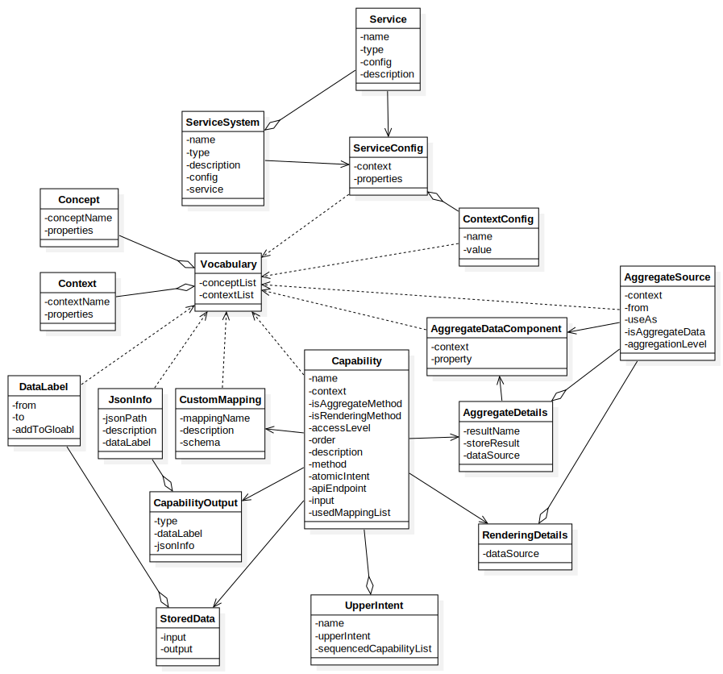

# Settings

## Concept model

> In order to let users alter existing capabilities, expand any tools or functions they need, and combine and disassemble previous functions, we extracted the attributes that might be used in function operation or information exchange, and designed a concept model



## Configuration file settings

### Vocabulary

```
ConceptList:
  - conceptName: conceptX
    properties:
    - propertyA
    - propertyB
ContextList:
  - contextName: tool
    properties:
    - conceptX.propertyA
    - Api.serviceName
```

### Capability

There are three types of capabilities:

- general
- global
- aggregate

#### General Capability

#### Global Capaility

#### Aggregate Capability

### Upper Intent

```
crossCapabilityList:
  # upper intent example
  - name: intent name
    upperIntent: <upper-intent>
    sequencedCapabilityList:
      - name: capability-step-1
        order: 0
        description: step 1
      - name: capability-step-2
        order: 1
        description: step 2
```

### Service

```
serviceList:
  - name: system-name
    type: system
    description: simple system
    config:
      - context: tool-A
        properties:
          - name: concept.propertyA
            value: property value A
    service:
      - name: microserviceX
        type: service
        description: microservice x detail
        config:
          - context: tool-B
            properties:
              - name: concept.propertyA
                value: property value B
      - name: microserviceY
        type: service
        description: microservice y detail
```
